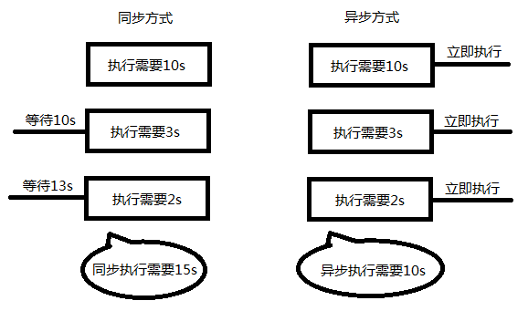
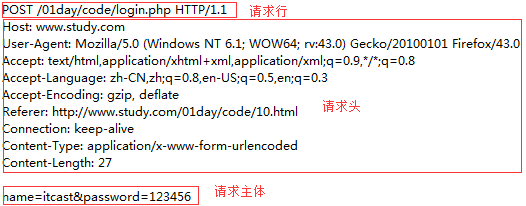

# AJAX

> 即 Asynchronous [e'sɪŋkrənəs] Javascript And XML， AJAX 不是一门的新的语言，而是对现有技术的综合利用。 本质是在HTTP协议的基础上以异步的方式与服务器进行通信。


## 同步与异步

同步和异步概念：

同步: 指的就是事情要一件一件做。等做完前一件才能做后一件事情

异步: 指某段程序执行时不会阻塞其它程序执行

异步优势：异步程序代码执行时不会阻塞其它程序代码执行, 从而提升整体执行效率。



网页异步应用：

1. 验证你的用户名是否已经存在（一边输入，一边获取你的信息，和后台比对）。
2. 百度搜索提示，及相关内容展示（一边输入，一边找出了你可能要的内容）。

XMLHttpRequest可以以异步方式的请求数据处理程序, 可实现对网页的部分更新，而不是刷新整个页面


## XMLHttpRequest对象

浏览器内建对象，用于与服务器通信(交换数据) ， 由此我们便可实现对网页的部分更新，而不是刷新整个页面。这个请求是异步，即在往服务器发送请求时，并不会阻碍程序的运行，浏览器会继续渲染后续的结构。

```
请求由客户端发起，其规范格式为：请求行、请求头、请求主体。
```




### 发送 get 请求

XMLHttpRequest以异步的方式发送HTTP请求，因此在发送请求时，一样需要遵循HTTP协议。

>  使用XMLHttpRequest发送get请求的步骤

```js
//1. 创建一个XMLHttpRequest对象
var xhr = new XMLHttpRequest();

//2. 设置请求行
// 第一个参数:请求方式  get/post
// 第二个参数:请求的地址 需要在url后面拼上参数列表
xhr.open("get", "01.php?name=Jepson");

//3. 设置请求头
//请求头中可以设置Content-Type,用以说明请求主体的内容是如何编码,get请求时没有请求体,无需设置

//4. 设置请求体
//get请求的请求体为空,因为参数列表拼接到url后面了
xhr.send(null);
```

注意点 :

- get请求,设置请求行时,需要把参数列表拼接到url后面
- get请求不用设置请求头, 不用说明请求主体的编码方式
- get请求的请求体为null

### 发送post请求

```js
var xhr = new XMLHttpRequest();

// 1. 设置请求行 post请求的参数列表在请求体
xhr.open("post", "02.php");

// 2. 设置请求头, post 请求必须要设置 content-type, 标记请求体内容的解析方式, 不然后端无法解析获取数据
xhr.setRequestHeader( "content-type", "application/x-www-form-urlencoded" );

// 3. 设置请求体
xhr.send( "name=Jepson&age=18" );
```

注意点 :

- post请求, 设置请求行时, 不拼接参数列表
- post必须设置请求头中的content-type为application/x-www-form-urlencoded, 标记请求体解析方式
- post 请求需要将参数列表设置到请求体中

### 获取响应

**readyState**

readyState:记录了XMLHttpRequest对象的当前状态

```
readyState有五种可能的值：
xhr.readyState = 0时，UNSENT open尚未调用
xhr.readyState = 1时，OPENED open已调用
xhr.readyState = 2时，HEADERS_RECEIVED 接收到头信息
xhr.readyState = 3时，LOADING 接收到响应主体
xhr.readyState = 4时，DONE 响应完成

不用记忆状态，只需要了解有状态变化这个概念
```


HTTP响应分为3个部分，状态行、响应头、响应体。

```js
//给xhr注册一个onreadystatechange事件，当xhr的状态发生状态发生改变时，会触发这个事件。
xhr.onreadystatechange = function () {
  
  if(xhr.readyState == 4){
    
    //1. 获取状态行
    console.log("状态行:"+xhr.status);
    
    //2. 获取响应头
    console.log("所有的响应头:"+xhr.getAllResponseHeaders());
    console.log("指定响应头:"+xhr.getResponseHeader("content-type"));
    
    //3. 获取响应体
    console.log(xhr.responseText);
    
  }
  
}
```


### 案例

【判断用户名是否存在】

【用户登录案例】

【聊天机器人案例】


## 数据交互

```
浏览器端只是负责用户的交互和数据的收集以及展示，真正的数据都是存储在服务器端的。

我们现在通过ajax的确可以返回一些简单的数据（一个字符串）, 但是在实际开发过程中，肯定会会设计到大量的复杂类型的数据传输，比如数组、对象等，但是每个编程语言的语法都不一样。

因此我们会采用通过的数据交换格式（XML、JSON）来进行数据的交互。
```

### XML(了解即可)

**什么是XML**

- XML 指可扩展标记语言（EXtensible Markup Language）
- XML 是一种标记语言，很类似 HTML
- XML 的设计宗旨是传输数据，而非显示数据
- XML 标签没有被预定义。您需要自行定义标签。

**语法规范**

- 第一行必须是版本信息
- 必须有一个根元素（有且仅有一个）
- 标签不可有空格、不可以数字或.开头、大小写敏感
- 不可交叉嵌套，都是双标签，如果是单标签，必须闭合
- 属性双引号（浏览器自动修正成双引号了）
- 特殊符号要使用实体
- 注释和HTML一样

```xml
<students>
    <student>
        <name>张三</name>
        <age>18</age>
        <gender>男</gender>
        <desc>路人甲</desc>
    </student>
    <student>
        <name>李四</name>
        <age>20</age>
        <gender>男</gender>
        <desc>路人乙</desc>
    </student>
</students>
```

**php获取xml文件的内容**

```php
// 注意: 如果需要返回 xml 数据, 需要将 content-type 改成 text/xml, 不然浏览器以 text/html 解析
header( 'content-type:text/xml;charset=utf-8' );
// file_get_content 用于获取文件的内容
// 参数: 文件的路径
$result = file_get_content( "data.xml" );
echo $result;
```

**js解析xml**

```js
//获取服务端返回的xml数据，需要使用xhr.responseXML，这是一个document对象，可以使用DOM中的方法查找元素。
var data = xhr.responseXML;
//获取所有的学生
var students = data.querySelectorAll("student");
```

缺点：虽然可以描述和传输复杂数据，但是其解析过于复杂, 并且体积较大，所以实现开发已经很少使用了。

### JSON数据

JSON(JavaScript Object Notation, JS 对象标记) 是一种轻量级的数据交换格式。它基于 ECMAScript 规范，采用独立于编程语言的文本格式来存储和表示数据。

- 数据在 键值对 中
- 数据由逗号分隔(最后一个 键值对 不能带逗号)
- 花括号保存对象，方括号保存数组
- 键使用双引号

```js
var obj = {a: 'Hello', b: 'World'}; //这是一个对象

// 这是一个 JSON 字符串，本质是一个字符串
var json = '{"a": "Hello", "b": "World"}';
```

**JSON数据在不同语言进行传输时，类型为字符串，不同的语言各自也都对应有解析方法，解析完成后就能很方便的使用了**

#### php处理json

- php关联数组 ==>  json   ( json_encode )

```php
// php的关联数组
$obj = array(
  "a" => "hello",
  "b" => "world",
  "name" => "鹏鹏"
);
//json字符串
$json = json_encode( $obj );
echo $json;
```

- json ==> php对象/关联数组	( json_decode )

```php
$json = '{"a": "Hello", "b": "World"}';//json字符串
//第一个参数：json字符串
//第二个参数：
//false，将json转换成对象(默认)
//true：将json转换成数组(推荐)
$obj = json_decode($json,true);
echo $obj['a'];

//通过json文件获取到的内容就是一个json字符串。
$data = file_get_contents("data.json");

//将json转换成数组
$result = json_decode($data, true);
print_r($result);
```


使用json进行数据传输

思考：

1. js有一个对象，如何发送到php后台
2. php中有一个数组，如何发送到前台。

【案例：获取表格数据.html】


## 兼容性 (了解, 不用处理)

现在一般最多兼容到 IE8, 这里见到了知道是在处理兼容性就行了

```js
var xhr = null;
if(XMLHttpRequest){
  //现代浏览器 IE7+
  xhr = new  XMLHttpRequest();
}else{
  //老版本的 Internet Explorer （IE5 和 IE6）使用 ActiveX 对象：
  xmlHttp = new ActiveXObject("Microsoft.XMLHTTP");
}
```


## 封装ajax工具函数( 拓展 )

> 每次发送ajax请求，其实步骤都是一样的，重复了大量代码，我们完全可以封装成一个工具函数。

```
//1. 创建xhr对象
//2. 设置请求行
//3. 设置请求头
//3. 设置请求体
//4. 监听响应状态
//5. 获取响应内容
```

### 参数提取

| 参数名      | 参数类型     | 描述      | 传值                        | 默认值                                      |
| -------- | -------- | ------- | ------------------------- | ---------------------------------------- |
| type     | string   | 请求方式    | get/post                  | 只要不传post，就是get                           |
| url      | string   | 请求地址    | 接口地址                      | 如果不传地址，不发送请求                             |
| async    | boolean  | 是否异步    | true/fase                 | 只要不传false，那就是true，异步请求                   |
| data     | object   | 请求数据    | `{key:value,key1:value2}` | 需要把这个对象拼接成参数的格式 uname=Jepson&upass=12345 |
| dataType | string   | 返回的数据类型 | xml/json/text             | text                                     |
| success  | function | 响应成功时调用 | -                         | -                                        |
| error    | function | 响应失败时调用 | -                         | -                                        |

### 参数检测

```js
// 要求参数obj必须传递，否则直接不发送请求
if(!obj || typeof obj !== "object"){
  return;
}
// 如果type传递的是post，那就发送post请求，否则发送get请求
var type = obj.type == "post"?"post":'get';
var url = obj.url;
if(!url){
  return;
}
// 只有当async传递了false，才会发送同步请求，不然只发送异步请求
var async = obj.async == false? false:true;
```


### 完整版本

```js
var $ = {
  ajax: function (options) {
    //如果options参数没有传递，直接返回。
    if (!options || typeof options !== "object") {
      return;
    }
    
    //处理默认参数
    //如果参数不是post，那就默认为get
    var type = options.type == "post" ? "post" : "get";
    //如果没有传url，那就传当前地址
    var url = options.url || location.pathname;
    //如果参数不是false，那就默认是true，发异步请求
    var async = options.async == false ? false : true;
    
    var params = this.getParams(options.data);
    
    var xhr = new XMLHttpRequest();
    
    //设置请求行
    if (type == "get") {
      url = url + "?" + params;
    }
    xhr.open(type, url, async);
    
    //设置请求头
    if (type == "post") {
      xhr.setRequestHeader("content-type", "application/x-www-form-urlencoded");
    }
    //设置请求参数
    xhr.send(params);
    
    xhr.onreadystatechange = function () {
      if (xhr.readyState == 4) {
        if (xhr.status == 200) {
          /*根据响应头的content-type属性指定方法接收到的内容*/
          var contentType = xhr.getResponseHeader('content-type');
          var data = null;
          if (contentType.indexOf('json') > -1) {
            data = JSON.parse(xhr.responseText);
          } else if (contentType.indexOf('xml') > -1) {
            data = xhr.responseXML;
          } else {
            data = xhr.responseText;
          }
          /*执行成功函数*/
          options.success && options.success(data);
        } else {
          options.error && options.error(xhr.responseText);
        }
        
      }
    }
  },
  getParams: function (obj) {
    //将obj对象转换成参数
    //将对象转换成参数列表
    if (!obj) {
      return null;
    }
    var arr = [];
    for (var k in obj) {
      arr.push(k + "=" + obj[k]);
    }
    return arr.join("&");
  }
  
}
```


# jQuery中的ajax方法

> jQuery为我们提供了更强大的Ajax封装

## $.ajax

参数列表

| 参数名称       | 描述       | 取值                  | 示例                                |
| ---------- | -------- | ------------------- | --------------------------------- |
| url        | 接口地址     |                     | url:"02.php"                      |
| type       | 请求方式     | get/post            | type:"get"                        |
| timeout    | 超时时间     | 单位毫秒                | timeout:5000                      |
| dataType   | 服务器返回的格式 | json/xml/text(默认)   | dataType:"json"                   |
| data       | 发送的请求数据  | 对象                  | data:{name:"zs", age:18}          |
| beforeSend | 调用前的回调函数 | function(){}        | beforeSend:function(){ alert(1) } |
| success    | 成功的回调函数  | function (data) {}  | success:function (data) {}        |
| error      | 失败的回调函数  | function (error) {} | error:function(data) {}           |
| complete   | 完成后的回调函数 | function () {}      | complete:function () {}           |


使用示例:

```js
$.ajax({
  type:"get",//请求类型
  url:"02.php",//请求地址
  data:{name:"zs", age:18},//请求数据
  dataType:"json",//希望接受的数据类型
  timeout:5000,//设置超时时间
  beforeSend:function () {
    //alert("发送前调用");
  },
  success:function (data) {
    //alert("成功时调用");
    console.log(data);
  },
  error:function (error) {
    //alert("失败时调用");
    console.log(error);
  },
  complete:function () {
    //alert("请求完成时调用");
  }
});
```


## 其他api(了解)

```js
// 发送get请求
$.get(url, data, callback, dataType);
$.get(option);

// 发送post请求
$.post(url, data, callback, dataType);
$.post(option)

// 发送get请求, 并设置 dataType为 json
$.getJSON(url, data, callback);
$.getJSON(obj);
```

## 接口化开发

请求地址即所谓的接口，通常我们所说的接口化开发，其实是指一个接口对应一个功能， 并且严格约束了**请求参数** 和**响应结果** 的格式，这样前后端在开发过程中，可以减少不必要的讨论， 从而并行开发，可以极大的提升开发效率，另外一个好处，当网站进行改版后，服务端接口进行调整时，并不影响到前端的功能。

### 获取短信验证码

**需求文档(产品)**

```
总需求：点击获取验证码按钮，向服务端发送请求, 调用服务器端短信接口, 服务器端根据传参, 调用第三方短信接口, 给手机发送验证码

需求1：格式校验
(1) 手机号码不能为空   如果为空提示"手机号不能为空"
(2) 手机号码格式必须正确, 提示"请输入正确的手机号码"
  
需求2：点击发送时，按钮显示为"发送中",并且不能重复提交请求

需求3：根据不同的响应结果，进行响应。
(1)如果接口调用成功
   如果响应代码为100，倒计时
   如果响应代码为101，提示手机号重复
(2)如果接口调用失败，告诉用户"服务器繁忙，请稍候再试"
```

**接口文档**

```
接口说明：获取短信验证码
接口地址：getCode.php
请求方式：get
接口传参：mobile 手机号
返回类型  json
接口返回：{
			"code":"101", 
			"msg":"手机号码存在", 
			"mobile":"18511249258"
		}
参数说明: code 当前业务逻辑的处理成功失败的标识  100:成功   101:手机号码存在
		 msg  当前系统返回给前端提示
		 mobile  当前的手机号码
```

### 注册接口

**表单序列化** serialize

jquery提供了一个`serialize()`方法序列化表单，说白就是将表单中带有name属性的所有参数拼成一个格式为`name=value&name1=value1`这样的字符串。方便我们获取表单的数据。

```js
//serialize将表单参数序列化成一个字符串。必须指定name属性
//name=hucc&pass=123456&repass=123456&mobile=18511249258&code=1234
$('form').serialize();
```

jquery的ajax方法，data参数能够直接识别表单序列化的数据

```js
$.post({
  url:"register.php",
  data:$('form').serialize(),
  dataType:'json',
  success:function (info) {
    console.log(info);
  }
});
```


**需求文档**

```
//注册功能
//总需求：点击注册按钮，向服务端发送请求
//需求1:表单校验
  //1.1 用户名不能为空，否则提示"请输入用户名"
  //1.2 密码不能为空，否则提示"请输入密码"
  //1.3 确认密码必须与密码一直，否则提示"确认密码与密码不一致"
  //1.4 手机号码不能为空，否则提示"请输入手机号码";
  //1.5 手机号码格式必须正确，否则提示"手机号格式错误"
  //1.6 短信验证码必须是4位的数字，否则提示"验证码格式错误"
//需求2：点击注册按钮时，按钮显示为"注册中...",并且不能重复提交请求
//需求3：根据不同响应结果，处理响应
  //3.1 接口调用成功
    //100 提示用户注册成功，3s后跳转到首页
    //101 提示用户"用户名jepson已经存在"
    //102 提示用户"验证码错误"
  //3.1 接口调用失败，提示"服务器繁忙，请稍后再试",恢复按钮的值
```


**接口文档**

```
接口说明：注册
接口地址：register.php
请求方式：post
接口传参：name:用户名 pass:密码 code:验证码  mobile:手机号
返回类型  json
接口返回：{
			"code":"100",
			"msg":"注册成功",
			"name":"Jepson"
		}
参数说明:
      code 当前业务逻辑的处理成功失败的标识  100:成功  101:用户存在 102:验证码错误
      msg  当前系统返回给前端提示
      name: 注册的用户名
```


# 模板引擎（拓展）

> 是为了使用户界面与业务数据（内容）分离而产生的，它可以生成特定格式的文档，用于网站的模板引擎就会生成一个标准的HTML文档。


## 为什么要使用模板引擎

我们通过ajax获取到数据后，需要把数据渲染到页面，在学习模板引擎前，我们的做法是大量的拼接字符串，对于结构简单的页面，这么做还行 

但是如果页面结构很复杂，使用拼串的话**代码可阅读性非常的差，而且非常容易出错，后期代码维护也是相当的麻烦。** 

总结来说拼串渲染两大缺点：

1. js中大量充斥着 html 结构拼串代码， 很冗余， 可读性差
2. 字符串拼接很麻烦， 且维护起来也很麻烦， 容易出错


## 常见的模板引擎

BaiduTemplate：http://tangram.baidu.com/BaiduTemplate/
velocity.js：https://github.com/shepherdwind/velocity.js/
ArtTemplate：https://github.com/aui/artTemplate

artTemplate是使用最广泛，效率最高的模板引擎，需要大家掌握。


## artTemplate的使用

[github地址](https://github.com/aui/art-template)

[中文api地址](https://aui.github.io/art-template/docs/)

### artTemplate入门

**1.引入模板引擎的js文件** 

```javascript
<script src="template-web.js"></script>
```

**2.准备模板** 

```html
<!--
  指定了type为text/html后，这一段script标签并不会解析，也不会显示。
-->
<script type="text/html" id="myTmp">
  <p>姓名：隔壁老王</p>
  <p>年龄：18</p>
  <p>技能：查水表</p>
  <p>描述：年轻力气壮</p>
</script>
```

**3.准备数据**

```javascript
// 3. 准备数据, 数据是后台获取的，可以随时变化
var obj = {
  userName:"隔壁老王",
  age: 18,
  skill:"查水表",
  desc:"年轻气壮"
}
```

**4.将模板与数据进行绑定**

```javascript
//第一个参数：模板的id
//第二个参数：数据对象, 模版中可以直接使用对象中的属性
//返回值：根据模板生成的字符串。
var html = template("myTmp", obj);
console.log(html);
```

**5.修改模板**

```html
<script type="text/html" id="myTmp">
  <p>姓名：{{userName}}</p>
  <p>年龄：{{age}}</p>
  <p>技能：{{skill}}</p>
  <p>描述：{{desc}}</p>
</script>
```


**6.将数据显示到页面**

```javascript
var div = document.querySelector("div");
div.innerHTML = html;
```


### artTemplate标准语法

**if语法**

```html
{{if gender='男'}}
  <div class="man">
{{else}}
  <div class="woman">
{{/if}}
```

**each语法**

```html
<!--
  1. {{each data}}  可以通过$value 和 $index获取值和下标
  2. {{each data v i}}  自己指定值为v，下标为i
-->
{{each data v i}}
  <li>
    <a href="{{v.url}}">
      
      <p>{{v.content}}</p>
     </a>
   </li>
{{/each}}
```

```javascript
//如果返回的数据是个数组，必须使用对象进行包裹，因为在{{}}中只写书写对象的属性。
var html = template("navTmp", {data:info});
```


# 同源与跨域

## 同源

### 同源策略的基本概念

>1995年，同源政策由 Netscape 公司引入浏览器。目前，所有浏览器都实行这个政策。
>同源策略：最初，它的含义是指，A网页设置的 Cookie，B网页不能打开，除非这两个网页"同源"。所谓"同源"指的是"三个相同"。

```
协议相同
域名相同
端口相同
```

举例来说，这个网址`http://www.example.com/dir/page.html`

协议是`http://`，域名是`www.example.com`，端口是`80`（默认端口可以省略）。它的同源情况如下。

```
http://www.example.com/dir2/other.html：同源

file:///F:/phpStudy/WWW/day01/04-demo/04.html 不同源(协议不同)
http://v2.www.example.com/dir/other.html：不同源（域名不同）
http://www.example.com:81/dir/other.html：不同源（端口不同）
```


### 同源策略的目的

> 同源政策的目的，是为了保证用户信息的安全，防止恶意的网站窃取数据。

虽然这个限制出于安全来说, 是很有必要，但是也给我们日常开发带来不好的影响。

比如实际开发过程中，往往都会把服务器端架设到一台甚至是一个集群的服务器中，把客户端页面放到另外一个单独的服务器。那么这时候就会出现不同源的情况，如果我们知道两个网站都是安全的话，我们是希望两个不同源的网站之间可以相互请求数据的。这就需要使用到**跨域** 。


## 跨域

演示跨域问题


### jsonp( 无兼容性问题 )

> JSONP(JSON with Padding)、可用于解决主流浏览器的跨域数据访问的问题。
>
> 原理：服务端返回一个定义好的js函数的调用，并且将服务器的数据以该函数参数的形式传递过来，这个方法需要前后端配合

`script` 标签 src属性请求数据 是不受同源策略的限制的，它可以载入任意地方的 js文件。类似的还有`img`和`link`标签

```
<!--不受同源策略的标签-->

<link rel="stylesheet" href="http://www.api.com/1.css">
<script src="http://www.api.com/1.js"></script>
```


#### jsonp演化过程1

php文件

```php
header("content-type:text/html;charset=utf-8");
echo "alert(1111)";
```

html文件

```html
<script src="http://www.api.com/testjs.php"></script>
```

原理：其实src的路径是什么文件不重要，无论引入js文件还是php文件，最后返回给浏览器的都是字符串，因此我们script标签是可以引入一个php文件的。


#### jsonp演化过程2

php文件

```php
header("content-type:text/html;charset=utf-8");
echo "var a = 118;";
```

html文件

```html
<script src="http://www.api.com/testjs.php"></script>
<script>
  //a打印出来了118
  console.log(a);
</script>
```

**我们现在做到了一件事情，从不同源的php文件中获取到了数据** 


缺点：获取数据的script标签必须写在使用的script标签的前面，必须保证先有数据才能对数据进行渲染。


#### jsonp演化过程3

php代码

```php
header("content-type:text/html;charset=utf-8");
$arr = array(
    "name"=>"zs",
    "age"=>18
);
$result = json_encode($arr);
//这是一段js函数的调用的代码，$result就是我们想要的数据
echo "func($result)";
```

js代码

```html
<script>
  function func(data) {
    console.log(data);
  }
</script>
<script src="http://www.api.com/testjs.php"></script>
```


缺点：后端必须知道前端声明的方法的名字，后端才能调用。


#### jsonp演化过程4

php代码

```php
header("content-type:text/html;charset=utf-8");
$arr = array(
    "name"=>"zs",
    "age"=>18
);
$result = json_encode($arr);
//这是一段js函数的调用的代码，$result就是我们想要的数据
echo $_GET['callback']."($result)";
```

javascript代码

```javascript
function fun(data) {
  console.log(data);
}
var button = document.querySelector("button");
button.onclick = function () {
  var script = document.createElement("script");
  script.src = "http://www.api.com/testjs.php?callback=fun";
  document.body.appendChild(script);
}
```


1. 说白了，jsonp的原理就是 借助了script标签 src 请求资源时, 不受同源策略的限制.

2. 在服务端返回一个函数的调用，将数据当前调用函数的实参。

3. 在浏览器端，需要程序要声明一个全局函数，通过形参就可以获取到服务端返回的对应的值

   ​


jsonp原理大家知道即可，不用太过于去纠结这个原理，因此jquery已经帮我们封装好了，我们使用起来非常的方便。


### jquery对于jsonp的封装

```js
//使用起来相当的简单，跟普通的get请求没有任何的区别，只需要把dataType固定成jsonp即可。
$.ajax({
  type:"get",
  url:"http://www.Jepson.com/testjs.php",
  dataType:"jsonp",
  data:{
    uname:"Jepson",
    upass:"123456"
  },
  success:function (info) {
    console.log(info);
  }
});
```


【案例：查询天气.html】

[天气查询api地址](https://www.jisuapi.com/api/weather/)


【案例：省市区三级联动.html】

[api地址](https://www.jisuapi.com/api/area/) 


### 跨域资源共享(CORS) ( 兼容性IE10+ )

#### cors的使用

> 新版本的XMLHttpRequest对象，可以向不同域名的服务器发出HTTP请求。这叫做["跨域资源共享"](http://en.wikipedia.org/wiki/Cross-Origin_Resource_Sharing)（Cross-origin resource sharing，简称CORS）。

跨域资源共享（CORS）的前提

- 浏览器支持这个功能( 兼容性IE10+ )
- 服务器必须允许这种跨域。

服务器允许跨域的代码：

```php
//允许所有的域名访问这个接口
header("Access-Control-Allow-Origin:*");
//允许www.study.com这个域名访问这个接口
header("Access-Control-Allow-Origin:http://www.jepson.com");
```


#### CORS的具体流程（了解）

服务器端收到一个简单跨域请求后，根据资源权限配置，在响应头中添加Access-Control-Allow-Origin Header。浏览器收到响应后，查看是否设置了`header('Access-Control-Allow-Origin:请求源域名或者*');`如果当前域已经得到授权，则将结果返回给[JavaScript](http://lib.csdn.net/base/javascript)。否则浏览器忽略此次响应。


#### 总结: 解决跨域两种最常用方式  jsonp与cors

#### jsonp与cors的对比

- jsonp兼容性好，老版本浏览器也支持，但是jsonp仅支持get请求，发送的数据量有限。使用麻烦
- cors需要浏览器支持cors功能才行。但是使用简单，**只要服务端设置允许跨域，对于客户端来说，跟普通的get、post请求并没有什么区别。**
- 跨域的安全性问题：**因为跨域是需要服务端配合控制的** ，也就是说不论jsonp还是cors，如果没有服务端的允许，浏览器是没法做到跨域的。


当然还有一种很常用的解决跨域的方式, 就是服务器端配置反向代理 ( 纯服务器端实施, 了解即可 )


